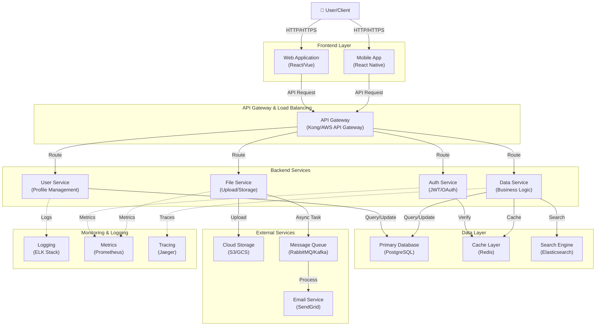

# Architecture Overview

## System Architecture

This document outlines the high-level architecture of the system, showing how different components interact with each other.

## Component Descriptions

### Frontend Layer
- **Web Application**: Browser-based client built with modern frontend frameworks
- **Mobile App**: Native or cross-platform mobile application

### API Gateway & Load Balancing
- **API Gateway**: Central entry point for all client requests, handles routing, rate limiting, and authentication

### Backend Services
- **Auth Service**: Handles user authentication and authorization (JWT, OAuth)
- **User Service**: Manages user profiles and account information
- **Data Service**: Core business logic and data processing
- **File Service**: Manages file uploads, downloads, and storage operations

### Data Layer
- **Primary Database**: Main persistent data storage (PostgreSQL)
- **Cache Layer**: In-memory cache for performance optimization (Redis)
- **Search Engine**: Full-text search capabilities (Elasticsearch)

### External Services
- **Cloud Storage**: Object storage for files and assets (S3/GCS)
- **Message Queue**: Asynchronous job processing (RabbitMQ/Kafka)
- **Email Service**: Transactional email delivery (SendGrid)

### Monitoring & Logging
- **Logging**: Centralized logging system (ELK Stack)
- **Metrics**: Performance and system metrics collection (Prometheus)
- **Tracing**: Distributed tracing for debugging (Jaeger)

## Data Flow

1. Users interact with the frontend application
2. Requests are routed through the API Gateway
3. Services process requests and query the data layer
4. Results are cached for performance
5. Async operations are queued for background processing
6. All activity is logged and monitored
